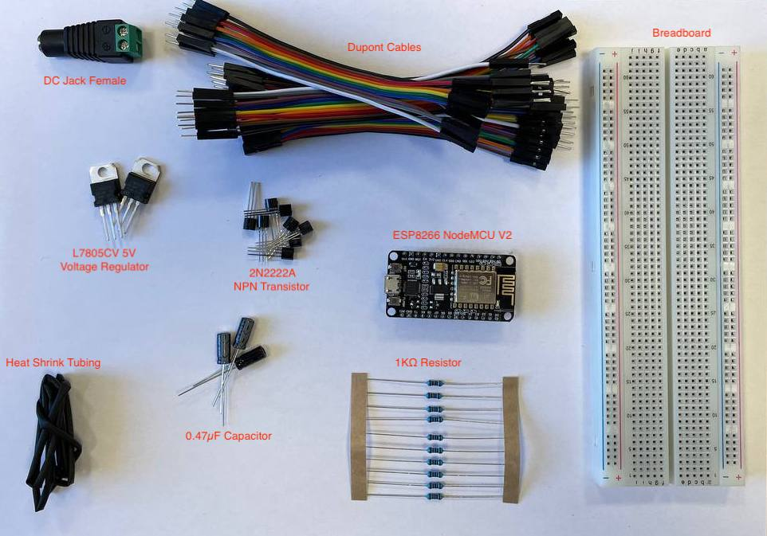
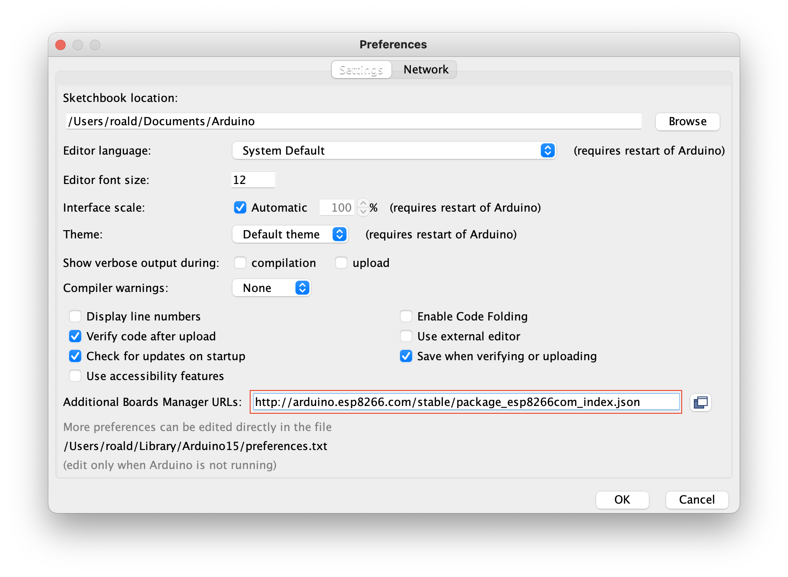
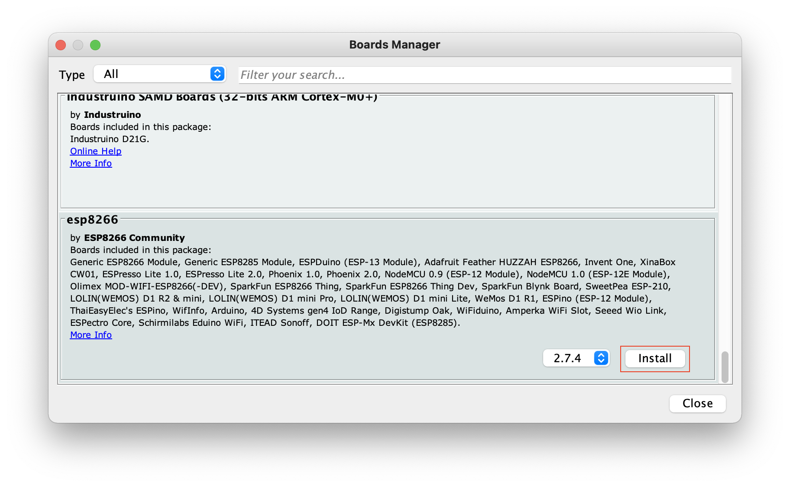
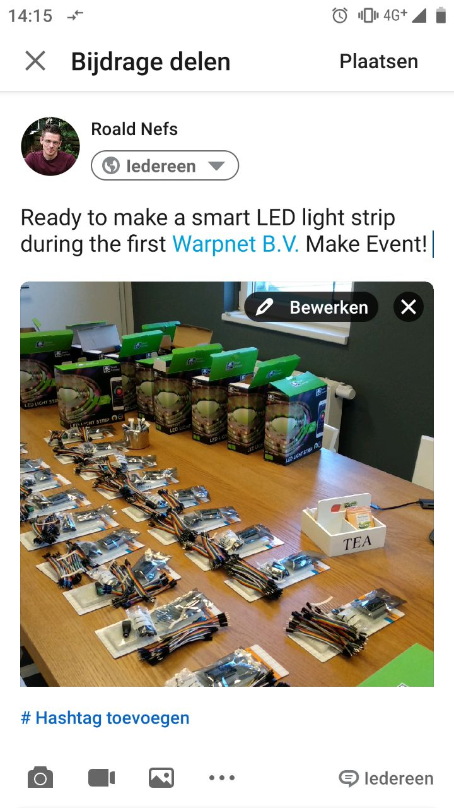

# Preparing for the Make Event

To get the most out of the Warpnet Make Event, you'll need to make sure your Warpnet Make Event kit is complete and the NodeMCU (WiFi-enabled Arduino ESP8266) is working. Please make sure to complete the steps below. It should only take about 30 minutes!

## Step 1 - Check the Components of the Make Event Kit

Check the components of the Warpnet Make Event kit you received, this should at least include:

- 1x DC Jack Female
- 10+ Dupont Cables
- 1x L7805CV 5V Voltage Regulator
- 5x 2N2222A NPN Transistor
- 5x 1KΩ Resistor
- 2x 0.47µF Capacitor
- 1x Breadboard
- 1x Micro USB Cable
- 1x ESP8266 NodeMCU V2
- 1x Heat Shrinking Tubing
- 1x RGBWY LED Strip (_not in the picture below_)
- 1x 12V Adapter (_not in the picture below_)

_Please contact the hosts of event (you received the contact details in the invite email) if you're missing any of the components._

## Step 2 - Arduino IDE

Download and install the [Arduino IDE](https://www.arduino.cc/en/software).

## Step 3 - Setup your System

By default the Arduino IDE doesn't recognize the ESP8266 NodeMCU V2

1. Open the Arduino IDE
2. Go to **Files** (_Linux/Windows_) or **Arduino** (_macOS_) and click on **Preferences**.
3. Add the following URL to the **Additional Board Manager URLs** field: `https://arduino.esp8266.com/stable/package_esp8266com_index.json`.

4. Click **OK** and close the preference window.
5. Go to **Tools**, **Board** and open the **Board Manager**.
6. Scroll down to **esp8266 by ESP8266 Community** and install the missing boards.

## Step 4 - Connect your ESP866

Make sure everything is working by uploading your first sketch to the ESP8266 NodeMCU V2 board.

1. Remove the ESP8266 NodeMCU V2 from the styrofoam, because the styrofoam is mildly conductive and may therefore short the board.
1. In the **Tools** menus, click the **ESP8266 Boards (2.7.4)** option and select **NodeMCU 1.0 (ESP-12E Module)**.
1. Plug the ESP8266 NodeMCU V2 board into your computer.
1. Select the right USB port from the **Tools** menu in the **Port** section. Check [Troubleshooting](README.md#troubleshooting) if the port is missing.
1. Copy and past the [blink.ino](blink/blink.ino) code into your Arduino IDE and upload the sketch by clicking **Upload**.
1. After compiling the code, it should automatically start uploading. Check [Troubleshooting](README.md#troubleshooting) if you run into issues with uploading the code to your ESP8266 NodeMCU V2.

## Step 5 - Share a Picture (optional)

Please help us spread the word about the **Warpnet Make Event** on LinkedIn so that we grow the community for future events.

Here's an example from [Roald](https://www.linkedin.com/in/roaldnefs/):

## Step 6 - Reading

Read through the [README](README.md) including [At the Make Event](README.md#at-the-make-event), [Project Extensions](README.md#project-extensions) and [Useful Resources](README.md#useful-resources) to get an idea where your want to take your smart LED light strip project during the Make Event.

Please edit or add to the documentation as you go, by following the [Contribution Guidelines](README.md#contributing).
