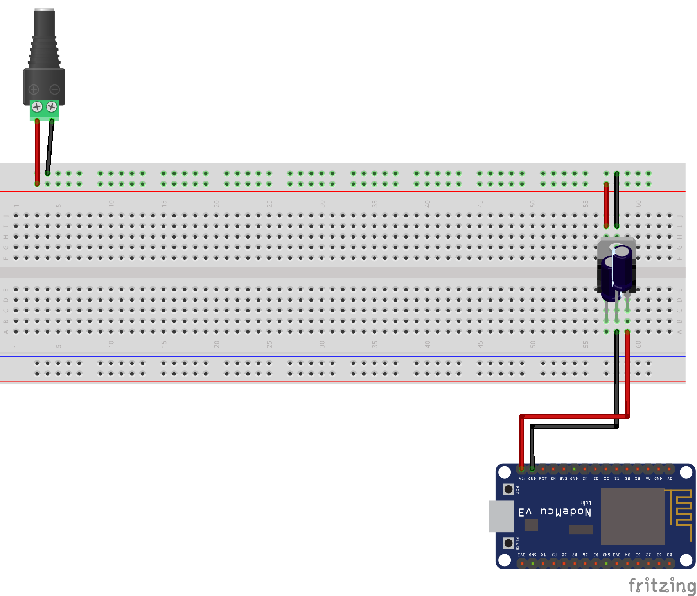
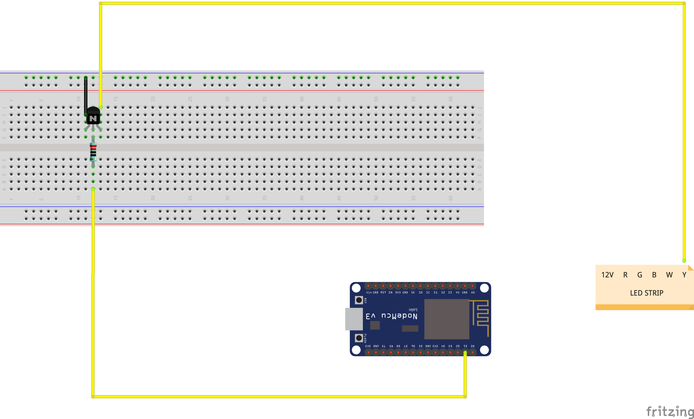
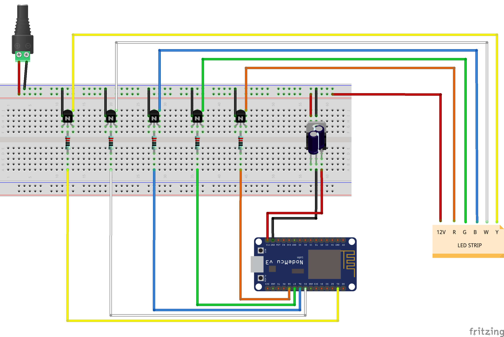

# Warpnet Make Event
During this Make Event you'll learn how to use a NodeMCU (WiFi-enabled Arduino ESP8266) to build a smart LED light strip - while connecting virtually with other people.

## Table of Contents
- [Preparing for the Make Event](#preparing-for-the-make-event)
- [At the Make Event](#at-the-make-event)
- [After the Make Event](#after-the-make-event)
- [Project Extensions](#project-extensions)
- [Useful Resources](#useful-resources)
- [Troubleshooting](#troubleshooting)

## Preparing for the Make Event
During the Make Event you'll be making a smart LED light strip. The aim of the Make Event is to explore and learn new things, while connecting with other people. Before the Make Event, complete the [Preparation Steps](PREPARE.md) to get the LED blinking on your new NodeMCU.

_Please see [Troubleshooting](#troubleshooting) if you run into issues or contact the hosts of event (you received the contact details in the invite email)._

During the event you'll need:
- The Warpnet Make Event kit (_LED strip, NodeMCU, etc._).
- Laptop/PC with USB-A port or adaptor.
- Scissor or utility knife.
- Lighter, or hair dryer(_optional_).
- Small screwdriver (_optional_).

## At the Make Event

During the event you'll be building your own smart LED light strip. We start by uploading a program to let the internal LED blink continuously, after which we will connect the NodeMCU to a 12V DC adapter. Once the adapter is connected, we can start to connect the LED light strip.

### Step 1 - Let there be light

Start by making sure the [blink.ino](blink/blink.ino) program is uploaded to your NodeMCU. This program will make the internal LED on NodeMCU continuously blink.

**Note:** you might have already done this during the [preparation steps](PREPARE.md)!

1. Remove the NodeMCU from the styrofoam, because the styrofoam is mildly conductive and may therefore short the board.
1. In the **Tools** menus, click the **ESP8266 Boards (2.7.4)** option and select **NodeMCU 1.0 (ESP-12E Module)**.
1. Plug the NodeMCU board into your computer.
1. Select the right USB port from the **Tools** menu in the **Port** section. Check [Troubleshooting](README.md#troubleshooting) if the port is missing.
1. Copy and paste the [blink.ino](blink/blink.ino) code into your Arduino IDE and upload the sketch by clicking **Upload**.
1. After compiling the code, it should automatically start uploading. Check [Troubleshooting](README.md#troubleshooting) if you run into issues with uploading the code to your NodeMCU.

### Step 2 - Power Feed

During the preparation steps you've connected the NodeMCU using an USB cable. As you might know the USB connection will only provide a [5V DC signal](https://en.wikipedia.org/wiki/USB). The LED light strip comes included with a 12V DC adapter. In order to power the NodeMCU using the 12V DC adapter, we will need to step down the voltage to 5V. Start by building the voltage regulator circuit as shown below:



1. Make sure the NodeMCU is **not** connected using the USB cable.
1. Connect a red cable to the (+) terminal and a black cable to the (-) terminal on the **female DC jack**. The other side of the cables can be connected to the (+) and (-) lanes on the breadboard.
1. Place the **voltage regulator** on the breadboard, as shown in the picture above.
1. The negative lead of the **capacitor** is shorter than the positive lead. In order place the capacitors on the breadboard you might need to cut the leads to the same size. The negative (_denoted with the (-) sign_) should be connected to the middle pin of the voltage regulator.
1. Connect the left pin of the voltage regulator to the (+) lane on the breadboard. Connect the middle pin to the (-) lane on the breadboard.
1. The right pin of the voltage regulator can be connected to the **VIN** pin on the NodeMCU while the middle pin can be connected to one of the **GND** pins on the NodeMCU.
1. Make sure everything is connected correctly before applying power to the adapter.

If everything is properly connected, the internal LED should start blinking again! You've now built your own voltage regulator circuit. If you still struggle to get this to work, you can take a peek at [this picture.](media/voltage_regulator_12V.jpg)

### Step 3 - Expose the connector on the LED strip

Before the original LED light strip can be connected to our own controller we will need to expose the connector. After exposing the connector we need to modify the cables in order to make them fit in the connector.

1. Start by cutting the heat shrink tubing around the connector on the original LED light strip using a scissor as shown in [this picture](media/cable.jpeg).
1. The exposed connector on the LED strip is too small to be used with the dupont cables. Remove the plastic caps on at least 6 dupont cables as shown in [this picture](media/cable_1.jpeg) and cut a small piece of heat shrink tubing to cover the exposed metal.
1. Place the heat shrink tubing around the exposed metal and make sure only the tip of the cable is exposed. Apply some heat to make it shrink, but be careful not to burn yourself or the plastic. [This picture](media/cable_2.jpeg) shows the end result.

### Step 4 - Connect to the LED strip using a transistor

Because the LED strip is 12V powered on one side, the other PINS (_R, G, B, Y, W_) need a path to the ground. To handle all the current, a transistor is used to switch many amps of power at different/high volts with a single lower power/voltage signal. The transistor will basically isolate the signal. If you were to connect the led strip directly to the NodeMCU, you would likely fry the NodeMCU as the NodeMCU can not handle the current that is put through by the LED strip.

Between the transistor and the NodeMCU you will need to place a resistor as well. The resistor is used to reduce the current flow between the transistor and the Node MCU.



1. Place the **transistor** with the rounded side to the back, as shown in the picture.
1. Connect the left PIN of the **transistor** to the ground. You need to place the wire behind the **transistor** and connect it to the (-) on the powerfeed of the breadboard.
1. Connect the middle PIN of the **transistor** to the resistor. You will need to place the resistor across the gap.
1. Connect the right side of the **transistor** to a colour PIN of the LED strip. Make sure you place the cable behind the resistor and connect it to the LED strip.
1. In order to control the colour, connect a cable to a datapin (you can use **D1**, **D5**, **D6**, **D7** and **D8**) of the **NodeMCU** to the **resistor**. Make sure this cable is in front of the **resistor**.

Repeat those steps for each R,G,B,W,Y channel. You can take a peek at [this picture](media/transistor_breadboard.jpg) to get a clearer view.

> **TIP:** Remove the plastic of one side of a male-male wire. To prevent signal interfering use the heat shrink tubing around the metal of the wire. You will then have a sleek cable that you can plugin into the LED strips.

> **Note:** Do not connect the LED strip directly to any of the PINS of the NodeMCU. If you do, you may fry your NodeMCU. In that case you can enjoy your beer while it lasts :).

### Step 5 - Let there be more light!

Once everthing is connected according to the schematic below, you can build a program to make the LED light strip smart.



1. Disconnect the NodeMCU from the 12V power supply before connecting it back to your PC using the USB cable.
1. Upload the [colour.ino](colour/colour.ino) program to your NodeMCU. Once uploaded you can disconnect the USB cable.
1. Before connecting the NodeMCU to the 12V power supply, turn up your PC volume, start [this song](https://www.youtube.com/watch?v=9ZrAYxWPN6c) and connect the power supply.

### Step 6 - Playtime!

Now that the basics of your LED light strip are up and running, it's time to let your own project shine!

See [Project Extensions](#project-extensions)

## After the Make Event

### Feedback

While enjoying your free beverage, we would like you to known if you enjoyed the first Warpnet Make Event. You can provide feedback on the Warpnet Make Event to contact the hosts of event (_you received the contact details in the invite email_).

### Contributing

Please edit or add to the documentation by submitting a [Pull Request in Github](https://github.com/warpnet/smart-led-event)! These are the steps to contribute to this project:

1. Fork the Warpnet Make Event project [github.com/warpnet/smart-led-event](https://github.com/warpnet/smart-led-event).
1. Edit the forked version.
1. Create a _Pull Request_ from your fork back into the main project.

## Project Extensions

You can find some project extension below for when you're finished with creating your the smart LED light strip.

* Connect the NodeMCU to WiFi.
* Connect it to your monitoring application. For example; when a critical error has occured the LED strip turns red.
* Set up a (web)server on the NodeMCU to control the colours of the LED.

## Useful Resources

You'll find some useful resources below:

* [Datasheet positive voltage regulator ICs](https://www.st.com/resource/en/datasheet/l78.pdf)

## Troubleshooting

### USB Port not Showing in the Arduino IDE

If the USB port does not show up in the Arduino IDE in the **Tools**, **Port** section, you may need to install the missing drivers.

1. Start by locating the USB to UART chip on the WiFi-enabled Arduino ESP8266 board. The chip is located next to the USB port.
2. Install the missing drivers:
    - [Drivers](https://www.silabs.com/developers/usb-to-uart-bridge-vcp-drivers) for the **CP2102 chipset**.
    - [Drivers](https://sparks.gogo.co.nz/ch340.html) for the **CH340 chipset**.

### Cannot open /dev/ttyUSB0: Permission denied

If the USB port shows up, but the sketch can not be uploaded to the board you might see the following error message (in red) in the Arduino IDE console: `Cannot open /dev/ttyUSB0: Permission denied` (where `/dev/ttyUSB0` is the port you selected earlier).

This means your system user is not allowed to write to `/dev/ttyUSB0`. This can be fixed by running one of the following commands:

* Ubuntu: `sudo usermod -a -G dialout $USER`
* Arch: `sudo usermod -a -G uucp $USER`

Be sure to log out and back in again for the change to take effect.

### macOS Big Sur Upload Error

On macOS Big Sur you might run into the following error while attempting to upload a sketch to your board: `pyserial or esptool directories not found next to this upload.py tool.`. The error is caused by a bug in the included PySerial package, for more information see the [Arduino Forum](https://forum.arduino.cc/t/pyserial-and-esptools-directory-error/671804/12).

1. Open the file `~/Library/Arduino15/packages/esp8266/hardware/esp8266/2.7.4/tools/pyserial/serial/tools/list_ports_osx.py`.
2. Replace line 29 and 30 with the following content:

```python
#iokit = ctypes.cdll.LoadLibrary(ctypes.util.find_library('IOKit'))
#cf = ctypes.cdll.LoadLibrary(ctypes.util.find_library('CoreFoundation')
iokit = ctypes.cdll.LoadLibrary('/System/Library/Frameworks/IOKit.framework/IOKit')
cf = ctypes.cdll.LoadLibrary('/System/Library/Frameworks/CoreFoundation.framework/CoreFoundation')
```

3. You should now be able to successfully upload a sketch to your board. If the error is still occurring, comment out the following section in `~/Library/Arduino15/packages/esp8266/hardware/esp8266/2.7.4/tools/esptool/esptool.py`:

```python
#try:
#    import serial.tools.list_ports as list_ports
#except ImportError:
#    print("The installed version (%s) of pyserial appears to be too old for esptool.py (Python interpreter %s). "
#          "Check the README for installation instructions." % (sys.VERSION, sys.executable))
#    raise
```
